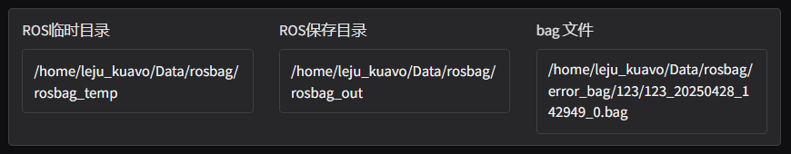
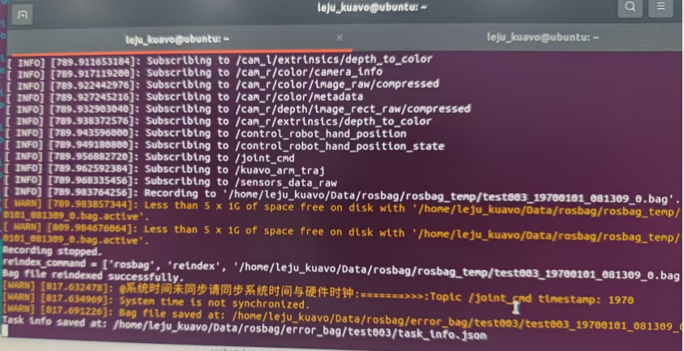

# 常见问题

## 一、error_bag异常

### 1. 问题描述

使用可视化界面进行数据采集时，可能会出现如下异常，录制出来的包是存在error_bag中：


### 2. 分析解决
可以使用`RosBag`工具查看异常的原因，点击前往[RosBag工具](https://get.foxglove.dev/desktop/latest/foxglove-latest-win.exe)

- 软件异常：
    - 未开启VR控制情况下开始录制
    - 上下位机通讯异常
    - 下位机Ros结点异常
    - 相机服务启动异常
        - **解决方法**
            - 重启相机服务`sudo systemctl restart start_camapp.service` 
- 硬件异常：
    - 相机损坏、连接异常
        - **解决方法**
            - 重新插拔相机并且重启相机服务
            - 更换相机
    - 电机损坏、连接异常
        - **解决方法**
            - 检查电机连接是否松动
            - 更换电机

## 二、时间戳不同步

### 1. 问题描述

采集时候报错，说硬件时钟与系统时间不同步：


### 2. 分析解决
使用如下脚本同步时间戳
```bash
sudo ~/kuavo_data_pilot/src/kuavo_data_pilot_bin/scripts/check_time.sh
```
