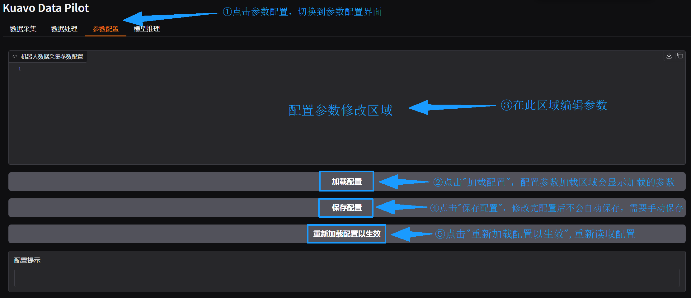
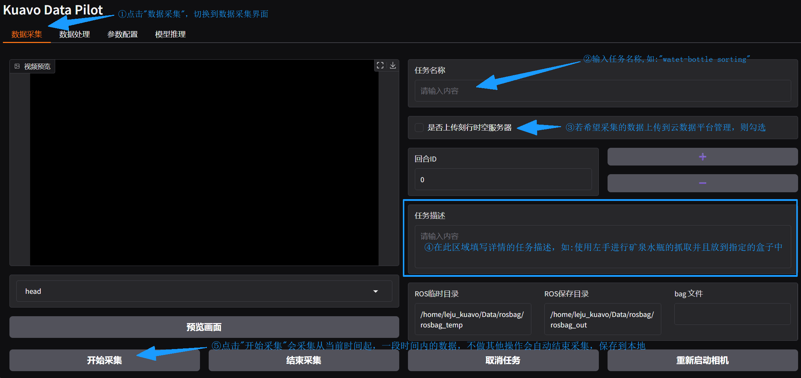
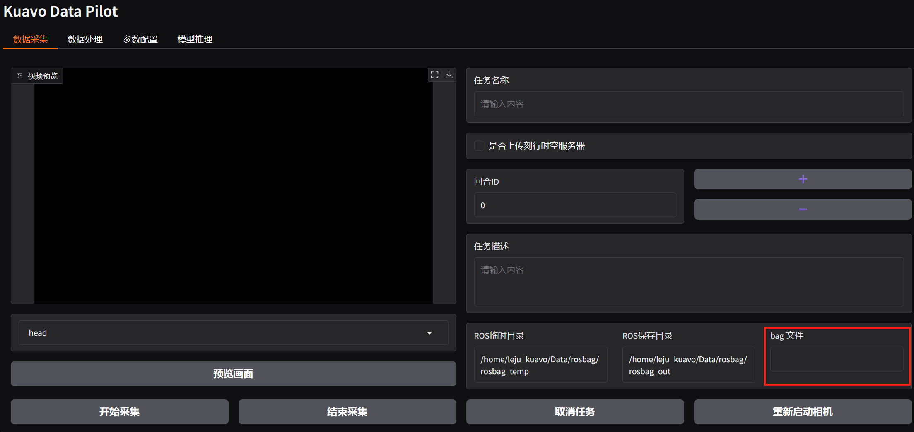

# 数据采集

  - ⚠️⚠️⚠️ **注意： 数采平台需要加密狗才能使用；建议加密狗直接插在AGX上(插在机器人后背容易丢)**

  - ⚠️⚠️⚠️ **注意： 下位机代码使用标签为`1.1.5`的`kuavo-ros-opensource`**[kuavo-ros-opensource · Gitee](https://gitee.com/leju-robot/kuavo-ros-opensource/tree/1.1.5/)

## 一、 章节介绍

数据采集是采集基于`ROS`录制某一时间段机器人行为生成的`RosBag`包，可将其视为原始数据。但提供给模型训练的数据是经过转化的数据，因此，本数据采集系统除提供最基础的**数据采集**功能外，还提供了**数据处理**功能。同时，鉴于机器人末端不同、资源存储路径存在差异等原因，本数据采集系统提供了灵活的**参数配置**。

## 二、 进入平台

机器人搭载了两块`NUC`，`NVIDIA Jetson AGX Orin`作为**上位机**，`摩方i9-13900`作为**下位机**。详细参数见[参考资料](#六-参考资料)。本产品案例分为三大步：采集，训练，推理。第一步采集第三步推理需要依赖上位机AGX的环境，训练依赖开源仓库（[kuavo-il-opensource](https://gitee.com/leju-robot/kuavo-il-opensource)）。所以进入采集平台前要获得要获得**上位机**在局域网中的ip。

### 1. 操作说明

**机器人上位机AGX的用户名和密码均为leju_kuavo**

1.给机器人上位机AGX连接WIFI（要能访问互联网），并查看AGX在该WIFI下的IP

2.启动程序

```bash
cd ~/kuavo_data_pilot/src/kuavo_data_pilot_bin/dist/app/
./kuavo_data_pilot_app
```

3.打开浏览器，在地址栏输入，按下回车访问

```bash
xxx.xxx.xxx.xxx:7860    #此处xxx.xxx.xxx.xxx需替换为实际的WIFI
```

- **warning 注意事项**
  
  浏览器地址栏输入的地址是由[通过wifi连接的IP]+[端口号7860]组成的


## 三、 参数配置
在开始数据采集前你需要对采集的参数进行配置
### 1. 操作说明

1.首先点击`TAB`栏的"参数配置"进行数据采集、数据处理的详细参数的配置。

2.然后点击"加载配置"，"配置参数修改区域"会显示配置在机器人中的有关"数据采集"的配置。

3.接着在"配置参数修改区域"编辑参数。

4.紧接着点击"保存配置"会将配置文件的内容更改并且写入。

5.最后点击"重新加载配置以生效"会使得本系统重新加载配置参数。操作如下图所示。



### 2. 属性说明

以下是对于配置参数属性的详细说明


- ⚠️⚠️⚠️ **注意事项**：如果末端类型为夹爪选择`use_lejuclaw`为true,`use_qiangnao`为false;末端类型为灵巧手则选择`use_qiangnao`为true，`use_lejuclaw`为false
- ⚠️⚠️⚠️ **注意事项**：强脑灵巧手有6个自由度。标准握拳状态[100] * 6, 张开状态[0] * 6。不需要精细操作或者多指协同操作时，通常为设置为1，表示只需要第一个关节作为开合依据,此时需要用[0, 100, 0, 0, 0, 0]表示张开状态, [100] * 6表示握拳状态，为达到此效果，需要在使用手柄数据采集时，用拇指触碰X,B让手在打开时拇指垂直于掌心平面。


|         属性名          |     类型      |                    说明                     |
| :---------------------: | :-----------: | :-----------------------------------------: |
|     rosbag_save_dir     |    String     |      数据采集录制完成后bag包存储的位置      |
|     rosbag_temp_dir     |    String     |    数据采集录制过程中临时bag包存储的位置    |
|    dataset_save_dir     |    String     |           转换后数据集存储的位置            |
|    model_save_dir       |    String     |           模型的存储文件夹位置              |
|    episode_duration     |    Integer    |         每个数据采集片段的持续时间（单位：秒）          |
|        robot_ip         |    String     |                上位机的IP地址               |
|        server_ip        |    String     | 转化后数据集/RosBag上传的目标服务器网络地址 |
|     server_username     |    String     |  转化后数据集/RosBag上传的目标服务器用户名  |
|     server_password     |    String     |   转化后数据集/RosBag上传的目标服务器密码   |
| server_rosbag_save_dir  |    String     |    RosBag上传的目标服务器的文件目录地址     |
| server_dataset_save_dir |    String     | 转化后数据集上传的目标服务器的文件目录地址  |
|      use_lejuclaw       |    Boolean    |  是否使用lejuclaw(机器人末端是否使用夹爪)   |
|      use_qiangnao       |    Boolean    | 是否使用qiangnao(机器人末端是否使用灵巧手)  |
|    only_half_up_body    |    Boolean    |            是否仅采集上半身数据             |
| record_topics_lejuclaw  | Array[String] |     使用lejuclaw时需要记录的ROS话题列表     |
| record_topics_qiangnao  | Array[String] |     使用qiangnao时需要记录的ROS话题列表     |

## 四、 数据采集

### 1. 操作说明

1.首先点击`TAB`栏的"数据采集"开始进行数据采集。

2.然后输入任务名称如：`water-bottle-sorting`

3.接着可以勾选"是否上传刻行时空"，如果勾选会自动将采集的数据上传到云数据存储平台

4.紧接着然后输入任务描述如："使用左手进行矿泉水瓶的抓取并且放到指定盒子中"

5.VR操作手开始准备采集，VR操作方式如下

>**STEP1-启动机器人**：
>​	[点击查看启动机器人的视频教程](https://www.bilibili.com/video/BV1sECgYXEb8/?spm_id_from=888.80997.embed_other.whitelist&t=44.179363&bvid=BV1sECgYXEb8)
> 01. 机器人开机后，将机器人双脚拉直。调整移位机高度，使机器人双脚吊离地面约10cm
> 02. 机器人双手竖直下垂，摆正各关节电机，使左右手臂从肩部到手臂末端形成一条直线
> 03. 摆正机器人各关节位置如视频20s所示
> 04. 机器人开机，遥控器长按电源键开机；机器人开机后需等待约1分钟与遥控器建立连接
> 05. 遥控器执行校准：左侧挡位拨到最左边，右侧挡位拨到最右边，按下D键，等待机器人执行校准
> 06. 校准过程中观察机器人各关节状态，如果出现异常转动及时拍下急停避免卡住限位
> 07. 校准成功后机器人全身关节使能，状态如视频所示
>	08. 遥控器长按"C+D"，结束校准
>	09. 遥控器执行站立前缩腿：左侧挡位拨到最左边，右侧挡位拨到最右边，按下C键，等待机器人缩腿
>	10. 移位机下放至机器人双脚离地10cm左右，按下C键，机器人站立
> 11. 移位机下放，避免安全绳拽到机器人


>**STEP2-开始VR操控模式**：
>​	[点击查看机器人启动VR操作教程](https://www.bilibili.com/video/BV1x7CgYWESu/?spm_id_from=888.80997.embed_other.whitelist&bvid=BV1x7CgYWESu)
> 01. 遥控器A键进入到VR控制模式（长按B键回到遥控器控制模式）
> 02. 选择左下角快速设置，点击进入选择WIFI并连接，确保机器人与VR连接在同一网络下
> 03. 回到VR端桌面，右下角选择Kuavo-Hand-Track-MR软件点击进入


>**STEP3-VR操控**：
>​	[点击查看机器人进行VR操作教程](https://www.bilibili.com/video/BV1x7CgYWE8i/?spm_id_from=888.80997.embed_other.whitelist&bvid=BV1x7CgYWE8i)
> 01. 左右手分别拿住两个手柄
> 02. 机器人头部：自动跟随人体头部运动
> 03. 按下右手柄B键：原地踏步
> 04. 左手摇杆控制机器人移动的前后，右手摇杆左右控制机器人移动的左右旋转
> 05. 按下右手柄A键：回到站立状态
> 06. 左右手柄上扳机分别控制左右手指开合，左手Y键用于锁定或解锁手指控制
> 07. 手指放到X、A键上(不按下)会分别触发左右灵巧手的大拇指向内侧运动
>	08. 按住X键后再按下A键解锁手臂，等待5秒用户与机器人手臂同步，完成后机器人手臂可跟随人手臂运动
>	09. 再次先按住X键，再按下A键，手臂回到初始位置，踏步时会跟随摆手
>	10. 同时按下左右手柄下扳机，手臂在当前位置锁住
> 11. 同时按下左右手柄上扳机，机器人手臂恢复跟随
> 12. 同时按左手"X+Y"键，机器人全身关节解锁(建议回到遥控器解锁机器人)

6.最后点击"开始采集"此时需要VR操作员配合完成在"指定时间内(参数配置中的`episode_duration`所指定的时间)"的特征动作。操作如下图所示。



7.操作成功后可以根据提示查看`RosBag`包的存储位置。之后的数据转化的对象是`/home/leju_kuavo/Data/rosbag/rosbag_out/water-bottle-sorting`。



- 此时配置的参数如下
```yaml
"rosbag_save_dir": "/home/leju_kuavo/Data/rosbag/rosbag_out",
"rosbag_temp_dir": "/home/leju_kuavo/Data/rosbag/rosbag_temp"
```
- 如果新建的采集任务是`water-bottle-sorting`，则第一次采集的成功的`RosBag`包`water-bottle-sorting_20250427_171557_0.bag`的存储位置为：
```bash
/home/leju_kuavo/Data/rosbag/rosbag_out/water-bottle-sorting/water-bottle-sorting_20250428_105822_0.bag
```
- 同一采集任务下采集多次后的目录结构如下

```bash
/home/leju_kuavo/Data/rosbag/rosbag_out/water-bottle-sorting/
├── water-bottle-sorting_20250428_105822_1.bag
├── water-bottle-sorting_20250428_110122_2.bag
├── water-bottle-sorting_20250428_112413_3.bag
├── water-bottle-sorting_20250428_115822_4.bag
└── task_info.json
```
- **warning 注意事项**
  
  - 进入本采集系统不会直接显示摄像头视频，需要点击"预览画面"按钮,会刷新一帧视频画面回传显示。
  - 如果点击预览画面黑屏或者相机未启动成功，点击"重新启动相机"按钮可重新启动相机
  - 若设置的`episode_duration`为N，在开区间(0，N)点击"结束采集"会中断话题录制，直接生成录制时间段内的`RosBag`包
  - 点击"取消任务"按钮，会中断话题录制，不生成`RosBag`包
  - ROS临时目录是指录话题数据时临时存放数据的目录，若想修改临时目录，请修改`rosbag_temp_dir`参数。
  - ROS保存目录是指录话题数据时保存数据的目录，若想修改保存目录，请修改`rosbag_save_dir`参数，
  - 若录制时出现不合法的数值时，会自动筛选，自动生成与`rosbag_save_dir`同级的`error_bag`文件夹，将错误的bag包存放在此文件夹。
  - 录制时会出现`errorBag`的情况，点击[异常排查-error_bag异常](./常见问题.md#一error_bag异常)。


## 五、 参考资料
### 1. 摩方i9-13900
- CPU：英特尔 酷睿 i9-13900H；
- GPU：Iris Xe Graphics；
- 内存：64G DDR5内存；
- 硬盘容量：500G固态；
- 主频：14核20线程 睿频5.4GHz；
- 网络：双频WiFi6E/蓝牙5.2（AX211）+双2.5G网口（intel i255）；
### 2. AGX Orin
- **CPU:**
  - 架构: Arm® Cortex®-A78AE
  - 核心数: 12 核（64GB 版本），8 核（32GB 版本）
  - 缓存: 3MB L2 + 6MB L3（64GB 版本），2MB L2 + 4MB L3（32GB 版本）
  - 最大频率: 可达 2.2 GHz
- **GPU:**
  - 架构: NVIDIA Ampere
  - 核心数: 2048 CUDA 核心（64GB 版本），1792 CUDA 核心（32GB 版本）
  - Tensor 核心: 64 个（64GB 版本），56 个（32GB 版本）
  - 最大频率: 最高可达 1.3 GHz
- **内存:**
  - 类型: LPDDR5
  - 容量: 可选 32GB 或 64GB
  - 带宽: 204.8 GB/s
- **硬盘容量:**
  - 类型: eMMC 5.1
  - 容量: 64GB
- **主频:**
  - CPU 最大频率为可达 2.2 GHz。
- **网络:**
  - 支持多种网络连接，包括1个千兆以太网口和1个10GbE接口。
- **AI性能:**
  - 性能指标: 可达275 TOPS（每秒万亿次操作） Jetson AGX Orin 提供了显著的性能提升，特别是在 AI 推理和深度学习任务中，相较于其前代产品 Jetson AGX Xavier，性能提升可达8倍。该平台非常适合需要实时处理和高计算能力的应用，如自动驾驶、智能城市和医疗保健等领域
