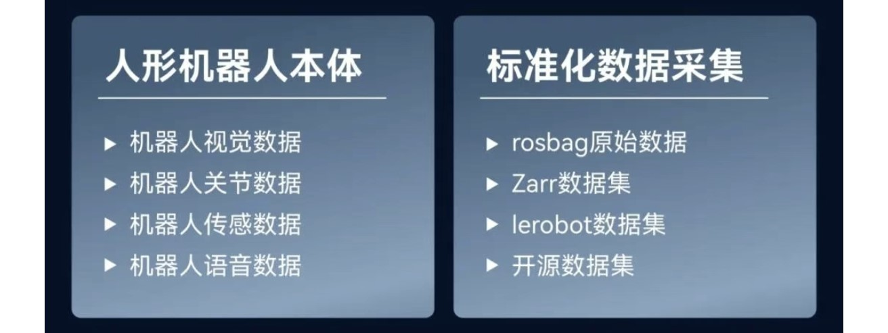

# KUAVO人形机器人训练场(科研版)案例概述

## 声明

  -  ⚠️⚠️⚠️ **注意： 该案例仅向选配训练场方案用户开放**

     - 产品名称：KUAVO人形机器人训练场(科研版)  
     - 产品定位：构建开箱即用的科研训练场，助力高校、实验室人形机器人具身科研与应用开发  
     - 核心平台：乐聚人形机器人平台（**KUAVO-4PRO** **&** **KUAVO-LB**）  

## **一、概述**

**KUAVO人形机器人训练场(科研版)** 是一款专为科研机构与高校实验室设计的综合解决方案，集成了**具身智能本体** **(KUAVO-4PRO & KUAVO-LB)**、**数据采集工具链**以及**模型训练与部署套件**。通过本方案，用户可轻松实现从数据采集到模型训练到模型部署的全链条闭环，助力人形机器人具身智能科研与应用开发。

## **二、架构与核心优势**

### **1. 架构**

- **具身智能本体**：**KUAVO-4PRO** 或  **KUAVO-LB** 人形平台，作为数据采集与模型部署的物理载体，适配多场景应用。  
- **数据采集工具链**：覆盖数据采集全流程，从采集任务创建、采集配置、数据上传、数据导出、数据筛选，数据转换、数据管理，一站式解决数据获取难题。  
- **模型训练与部署**：搭载 NVIDIA Jetson AGX Orin 开发套件（算力高达 275 TOPS）；提供高算力训练平台，支持边缘侧高效训练与部署，加速科研成果落地。  

**三者关系**

  **具身智能本体**负责采集真实场景数据；**数据采集工具链**对数据进行标准化处理；**模型训练与部署套件**基于处理后的数据进行模型训练；并将训练好的模型重新部署至本体上。形成数据到模型的全链条闭环。

### **2. 核心优势**

- **高性能具身智能本体**：**KUAVO-4PRO** 与 **KUAVO-LB** 人形平台，提供物理执行能力与算力支持，满足多样化科研需求。  
- **完善的数据采集工具链**：从数据采集到存储到数据标准化处理，全流程自动化处理，降低数据获取门槛，统一数据标准。  
- **丰富的训练方案**：提供多种预训练模型与训练框架，支持用户自定义训练任务，加速科研探索。  

## **三、核心目标**

### **1. 降低具身智能开发门槛**

- **实现路径**：通过完善的工具链，用户无需专业编程技能，即可完成数据采集转化、训练、部署全流程，助力开发具身智能模型。
  

### **2. 统一数据标准**

- **实现路径**：工具链内置数据标准化模块，确保采集数据的一致性与可复用性，打通本体、数据、训练、模型边界。

### **3.整合具身开发工具**

- **实现路径**：提供一站式开发平台，减少重复造轮子，驱动科研成果高效转化，加速具身智能科研进程。 

---

## **四、组件详解**

#### **1. 具身智能本体**

- **KUAVO-4PRO 和 KUAVO-LB**：双平台支持，支持多场景应用，满足复杂任务执行需求。  
- **应用场景**：工业巡检、服务机器人、科研实验等。

| 产品名称   | 简介                                                                                     | 了解更多                                                                 |
|------------|------------------------------------------------------------------------------------------|--------------------------------------------------------------------------|
| KUAVO 4PRO | 高性能具身本体，高仿真人形机器人，配备30自由度，专为高级研究与复杂工业应用（如装箱、搬运等）设计。 | [产品介绍](https://kuavo.lejurobot.com/beta_manual/basic_usage/kuavo-ros-control/docs/1%E4%BA%A7%E5%93%81%E4%BB%8B%E7%BB%8D/%E4%BA%A7%E5%93%81%E4%BB%8B%E7%BB%8D/) |
| KUAVO LB   | 高灵活性轮式人形机器人，配备夹爪或多指灵巧手，理想用于教学演示与家庭服务等场景。         | [产品介绍](https://kuavo.lejurobot.com/beta_manual/basic_usage/kuavo-ros-control/docs/1%E4%BA%A7%E5%93%81%E4%BB%8B%E7%BB%8D/%E8%BD%AE%E8%87%82%E4%BA%A7%E5%93%81%E4%BB%8B%E7%BB%8D/) |

#### **2. 全流程协作框架**

- **采集管理一体化框架**：整合数据采集、存储、筛选、存储、管理的代码框架。

- **kuavo-il-opensource 训练部署一体化框架**：基于lerobot，整合模型训练、部署全流程代码，提供开箱即用的开发环境。用户无需编写底层训练/部署逻辑，仅需配置任务参数与数据路径，即可快速启动模型迭代，显著降低开发门槛与工程化成本。

#### **3. 数据采集工具链**

- **数据采集工具**：集成VR采集工具，支持自动采集、自动上传，提升数据采集效率。
- **数据转换工具**：支持数据格式转换（例如RosBag转Lerobot、Zarr），提升数据质量与可复用性。
- **云数据存储管理平台**：支持数据上传、导出、筛选、管理，提升数据管理效率。

#### **4. 模型训练与部署套件**

- **NVIDIA Jetson AGX Orin 开发套件**：边缘侧算力高达 275 TOPS，支持实时数据处理与模型部署，确保系统高效运行。
- **多卡集群算力训练平台**：集群架构，支持多卡集群训练，加速模型训练。 
