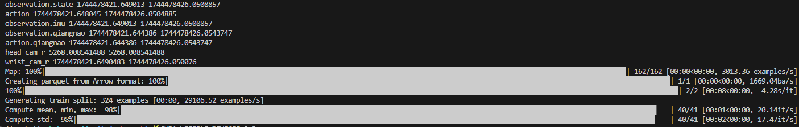
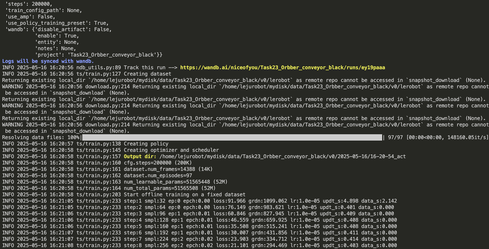
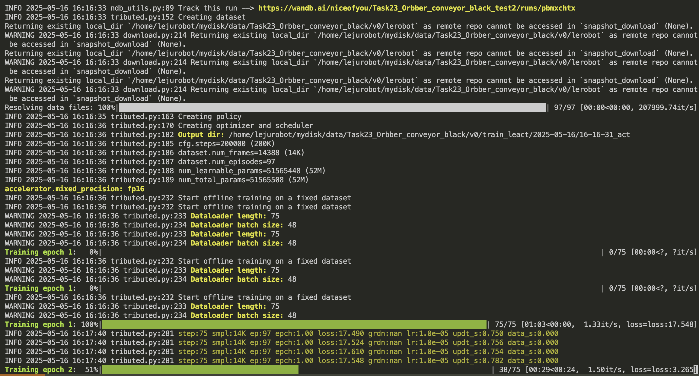

# 模型训练

- **特别说明**
  
    从这里开始，涉及到`kuavo-il-opensource`框架的使用，用处如下：
    - `kuavo-il-opensource`作为模型训练框架被部署到训练机

## 一、前置说明
通过[数据采集](./数据采集.md#四-数据采集)，在机器人`上位机`上获得到的原始`RosBag`数据集是`/home/leju_kuavo/Data/rosbag/rosbag_out/water-bottle-sorting`，目录结构如下：

```bash
/home/leju_kuavo/Data/rosbag/rosbag_out/water-bottle-sorting/
├── water-bottle-sorting_20250428_105822_1.bag
├── water-bottle-sorting_20250428_110122_2.bag
├── water-bottle-sorting_20250428_112413_3.bag
├── water-bottle-sorting_20250428_115822_4.bag
└── task_info.json
```

**[注]**：以下案例使用的`RosBag`包是使用可视化界面进行数据采集的，数据采集的操作步骤请参考[数据采集](./数据采集.md#二-进入平台)。数据采集后的存储配置见[数据采集-参数配置](./数据采集.md#三-参数配置)。

## 二、环境配置

在您用来训练采集数据的主机或服务器上执行
```bash
git clone https://gitee.com/leju-robot/kuavo-il-opensource.git
cd kuavo-il-opensource
conda create -y -n kuavo_il python=3.10
conda activate kuavo_il
pip install -e lerobot
```

## 三、原始数据集转移
需要将采集好的数据从AGX转移到训练用的主机或服务器
### 1. 明确目标路径
训练机上的数据存放的目标路径为：`/home/lejurobot/mydisk/data`，希望RosBag数据集转移后构建的目录结构如下：

```txt
/home/lejurobot/mydisk/data/water-bottle-sorting/
├── rosbag/                    ← 未转换的ROSBag包（原始数据）
    ├── water-bottle-sorting_20250428_105822_1.bag
    ├── water-bottle-sorting_20250428_110122_2.bag
    ├── water-bottle-sorting_20250428_112413_3.bag
    ├── ...
    └── task_info.json
```
### 2. 进行转移

在机器人**上位机**执行以下命令：

```bash
rsync -av --info=PROGRESS /home/leju_kuavo/Data/rosbag/rosbag_out/water-bottle-sorting/ lejurobot@192.168.20.4:~/mydisk/data/water-bottle-sorting/rosbag/
```
## 四、数据转换
数据采集时会生成`RosBag`包，在进行模型训练时需要将`RosBag`包转换为`lerobot`格式或者`zarr`格式。目前文档介绍的是基于`lerobot`格式进行模型训练。转化为`zarr`格式仅做演示，后序的训练不使用。


### 1. 脚本转换
#### bag转换lerobot
1.克隆仓库

**[注]**：如果机器人预先配置好此仓库，则无需执行此步，直接执行下面的步骤即可。
```bash
git clone https://gitee.com/leju-robot/kuavo-il-opensource.git
```
2.进入仓库
```bash
cd ~/kuavo-il-opensource #将这个文件夹视作项目根目录
```
3.参数配置
数据转化的相关配置文件为`/home/leju_kuavo/kuavo-il-opensource/kuavo/kuavo_1convert/common/lerobot_dataset.yaml`，具体配置属性详细说明如下：

```yaml
only_arm: true  # 默认true, 是否只使用手臂数据, 目前的模仿学习只用于手臂数据
eef_type: dex_hand # or leju_claw
which_arm: right  # 可选: left, right, both

train_hz: 30  # 训练采样频率
main_timeline_fps: 30 # 主相机的帧率，必须稳定, 主相机来自head_cam_h, wrist_cam_l, wrist_cam_r
sample_drop: 10 # 丢弃回合前后的10帧

# dex_dof_needed是强脑手需要的自由度数目。强脑灵巧手有6个自由度。标准握拳状态[100] * 6, 张开状态[0] * 6。
# 1: 不需要精细操作或者多指协同操作时，通常为设置为1，表示只需要第一个关节作为开合依据,此时需要用[0, 100, 0, 0, 0, 0]表示张开状态, [100] * 6表示握拳状态。
# 2(暂未测试): 或者设置为2，目前的手柄遥操作只有两个自由度。0,2,3,4,5自由度绑定为1个自由度。
# 6(暂未测试): 如果脱离手柄使用手指灵巧操作，可以设置为6，表示需要所有6个自由度。
dex_dof_needed: 1   # default=1

is_binary: false  # 是否将开合二值化, default=false
delta_action: false # 是否使用增量动作，default=false
relative_start: false # 是否使用相对起始位置, default=false

resize:
  width: 640
  height: 480
```

4.进行格式转换
```bash
python ./kuavo/kuavo_1convert/cvt_rosbag2lerobot.py  --raw_dir /home/lejurobot/mydisk/data/water-bottle-sorting/rosbag -v v0
```
**[注]**: 转换代码格式

```bash
Python [转换脚本]  --raw_dir [装载RosBag数据集的文件夹的路径]  -n [指定转换几个] -v [转换后数据集的名称]
```

5.转换过程中没有报错如下图



**[注]**:转换后的lerobot数据在指定存放在**装载RosBag数据集的文件夹**的同级目录，本案例的转换后目录结构如下
```bash
/home/lejurobot/mydisk/data/water-bottle-sorting/
├── v0/
│   └── lerobot/               ← 转化好的训练数据集（用于训练）
│       ├── data/
│       ├── meta/
│       └── videos/
│
└── rosbag/                    ← 未转换的ROS bag包（原始数据）
    ├── water-bottle-sorting_20250428_105822_1.bag
    ├── water-bottle-sorting_20250428_110122_2.bag
    ├── water-bottle-sorting_20250428_112413_3.bag
    ├── ...
    └── task_info.json
```

#### bag转换zarr(此案例主线未使用zarr格式，仅做演示)
1.Git clone 仓库

```bash
git clone https://gitee.com/leju-robot/kuavo-il-opensource.git
```
2.进入仓库

```bash
cd kuavo-il-opensource
```
3.进行格式转换

```bash
python /home/lejurobot/tjy/kuavo-il-opensource/kuavo/kuavo_1convert/cvt_rosbag2zarr.py -b /home/lejurobot/mydisk/data/Task17_cup/rosbag -c /home/lejurobot/tjy/kuavo-il-opensource/kuavo/kuavo_1convert/config/Task14_cup.yaml -n 3 -a
```
**[注]**: 转换代码格式如下

```bash
Python [转换脚本]  
-b [bag数据集文件] 
-c [配置文件路径(根据bag话题修改对应的yaml文件，内包含不同话题的处理方法以及抽帧值)] 
-n [需要处理的bag包数量]
-a [如果需要合并多个任务的数据，这里可以加上-a] 
-l [图像的压缩质量，越小质量越低(0-100)]
```

### 2. 可视化转换(可跳过此步骤 废弃)
[数据采集-数据处理-操作说明](./数据采集.md#五-数据处理)

- 若此时配置的参数如下，且设置的转化后目标数据集名称为`water-bottle-sorting-10fps`：
```yaml
    "dataset_save_dir": "/home/leju_kuavo/Data/convert_dataset/water-bottle-sorting-10fps"
```
- 则可视化转化后的数据存储位置为
```bash
/home/leju_kuavo/Data/convert_dataset/water-bottle-sorting/
```

```bash
/home/leju_kuavo/Data/convert_dataset/
└── water-bottle-sorting(转化后任务数据集文件夹)
    ├── water-bottle-sorting-10fps(10fps的转化)
        ├── data
        ├── meta
        └── videos
```

**[注]**: 可视化数据转换是针对一个任务数据集进行转换，换句话说，一次采集任务会有多个`RosBag`包，这些包组成一个任务，可视化数据转化时没有类似于脚本转化时的`-n`参数，默认会将该任务下的所有`RosBag`包进行转换。

## 五、模型训练
在上面的数据转化案例中，可视化数据转换后和脚本转化后得到的对象的文件夹包名都是`water-bottle-sorting`，最终用于模型训练的文件夹包名是有存放`data`、`meta`、`videos`的文件夹。因此可视化数据转化用于模型训练的是`/home/leju_kuavo/Data/convert_dataset/water-bottle-sorting/water-bottle-sorting-10fps`，脚本数据转化用于模型训练的是`/home/leju_kuavo/Data/rosbag/rosbag_out/water-bottle-sorting_10fps/lerobot`。
### 1. LeRobot单卡训练
1.进入仓库中lerobot的上级文件夹

2.执行命令
```bash
python lerobot/lerobot/scripts/train.py \
    --policy.type act \ 
    --dataset.repo_id Task23_Orbber_conveyor_black/lerobot \
    --dataset.local_files_only true \
    --dataset.root ~/mydisk/data/Task23_Orbber_conveyor_black/v0/lerobot/ \
    --save_checkpoint true \
    --batch_size 32 \
    --num_workers 8 \
    --output_dir ~/mydisk/data/Task23_Orbber_conveyor_black/v0 \
    --steps 200000 \
    --save_freq 20000 \
    --log_freq 200
```

```bash
# 如果需要记录训练过程，可以加上以下参数
    --wandb.enable true \
    --wandb.project Task23_Orbber_conveyor_black \
```

3.参数信息如下：

|            参数            |                            描述                            |                         示例值                         |
| :------------------------: | :--------------------------------------------------------: | :----------------------------------------------------: |
|       `policy.type`        |                 policy类型(act, diffusion)                 |                          act                           |
|     `dataset.repo_id`      | 从hf上拉数据需要，如果使用本地数据可以填<TaskName/lerobot> |          Task23_Orbber_conveyor_black/lerobot          |
| `dataset.local_files_only` |                    默认使用本地数据训练                    |                         `true`                         |
|       `dataset.root`       |                   本地lerobot数据集路径                    | ~/mydisk/data/Task23_Orbber_conveyor_black/v0/lerobot/ |
|     `save_checkpoint`      |                      是否需要存储ckpt                      |                          true                          |
|        `batch_size`        |                     模型训练batch大小                      |                           32                           |
|       `num_workers`        |                    数据加载使用cpu数量                     |                           8                            |
|        `output_dir`        |                        模型输出目录                        |     ~/mydisk/data/Task23_Orbber_conveyor_black/v0      |
|       `wandb.enable`       |         是否需要使用wandb记录训练过程,默认`false`          |                         `true`                         |
|      `wandb.project`       |                     为本次训练过程命名                     |              Task23_Orbber_conveyor_black              |
|          `steps`           |          总训练采样batch次数，一般100000～200000           |                         200000                         |
|        `save_freq`         |    每20000采样存储一次训练结果，可以取中间训练结果验证     |                         20000                          |
|         `log_freq`         |           每200次采样log一次loss等数据显示到终端           |                          200                           |

4. 训练如下图所示



### 2. LeRobot 多卡分布式训练

1.进入仓库中lerobot的上级文件夹

2.执行命令
```bash
export CUDA_VISIBLE_DEVICES=0,1,2,3 GPUS=4;
accelerate launch --num_processes=$GPUS --main_process_port 29399 --mixed_precision fp16\
    lerobot/lerobot/scripts/train_distributed.py \
    --policy.type act  \
    --dataset.repo_id Task23_Orbber_conveyor_black/lerobot\
    --dataset.local_files_only true \
    --dataset.root ~/mydisk/data/Task23_Orbber_conveyor_black/v0/lerobot/ \
    --save_checkpoint true \
    --batch_size 32 \
    --num_workers 8 \
    --output_dir ~/mydisk/data/Task23_Orbber_conveyor_black/v0/ \
    --epochs 500 \
    --save_epoch 50
```

```
# 如果需要记录训练过程，可以加上以下参数
    --wandb.enable true \
    --wandb.project Task23_Orbber_conveyor_black \
```

3.参数信息如下：

|            参数            |           描述           |                       示例值                        |
| :------------------------: | :----------------------: | :-------------------------------------------------: |
|      `num_processes`       |   训练时使用的GPU数量    |                         3                         |
|    `main_process_port`     |   执行训练进程的端口号   |                       29599                       |
| `mixed_precision` |   是否使用混合精度训练   |                       fp16                        |
| `policy.type` |   policy类型(act, diffusion)  |                         act                         |
| `dataset.repo_id` |    从hf上拉数据需要，如果使用本地数据可以填<TaskName/lerobot>  |                       Task23_Orbber_conveyor_black/lerobot                       |
| `dataset.local_files_only` |  默认使用本地数据训练    |                       `true`                        |
| `dataset.root` | 本地lerobot数据集路径 |              ~/mydisk/data/Task23_Orbber_conveyor_black/v0/lerobot/              |
|       `save_checkpoint`       |   是否需要存储ckpt       |   true   |
|        `batch_size`        |    模型训练batch大小        | 32 |
| `num_workers` |    数据加载使用cpu数量   |                         8                         |
| `output_dir` |    模型输出目录  |                       ~/mydisk/data/Task23_Orbber_conveyor_black/v0                       |
| `wandb.enable` |   是否需要使用wandb记录训练过程,默认`false`   |                       `true`                        |
| `wandb.project` | 为本次训练过程命名 |              Task23_Orbber_conveyor_black              |
|       `epochs`       |   训练轮数(数据集遍历一轮)   |   600   |
|        `save_epoch`        |    每50轮存储一次训练结果        | 50 |

4.成功启动训练则显示下图



5.训练完成后，目录层级结构如下

```bash
/home/lejurobot/mydisk/data/water-bottle-sorting/
├── v0/
│   ├── lerobot/               ← 转化好的训练数据集（用于训练）
│   │   ├── data/
│   │   ├── meta/
│   │   └── videos/
│   │
│   └── train_leact/           ← 训练输出目录（保存模型、日志等）
│       └── 2025-04-29/10-28-17_act/checkpoints/
│           ├── 020000/        ← 训练了20000轮的模型
│           │   ├── pretrained_model  ← 模型文件 
│           │   └── training_state
│           ├── 040000/        ← 训练了40000轮的模型
│           │   ├── pretrained_model  ← 模型文件
│           │   └── training_state
│           └── last/          ← 正在训练的模型
│
└── rosbag/                    ← 未转换的ROS bag包（原始数据）
    ├── water-bottle-sorting_20250428_105822_1.bag
    ├── water-bottle-sorting_20250428_110122_2.bag
    ├── water-bottle-sorting_20250428_112413_3.bag
    ├── ...
    └── task_info.json
```