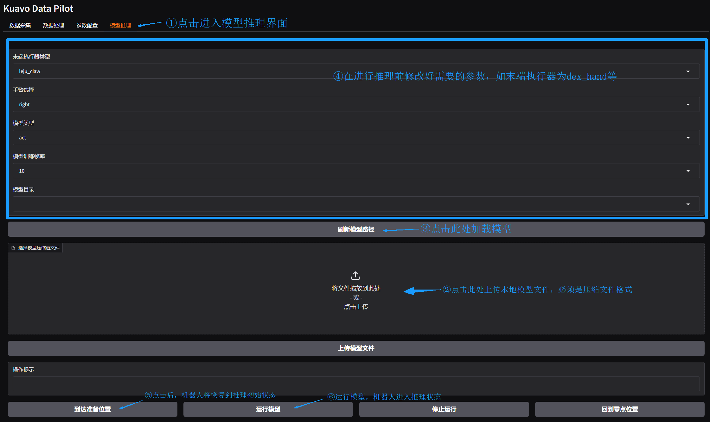

# 模型部署

通过[模型训练](../模型训练.md)，在**训练机**得到了训练的40000轮的模型产物，路径为：`/home/lejurobot/mydisk/data/water-bottle-sorting/v0/train_leact/2025-04-29/10-28-17_act/checkpoints/040000/pretrained_model`。

## 一、模型转移

### 1. 明确目标路径

机器人**上位机**上的数据存放的目标路径为：`/home/leju_kuavo/model/`，希望模型转移后构建的目录结构如下：

```txt
/home/leju_kuavo/model/water-bottle-sorting/
├── v0/train_leact/
│       └── 2025-04-29/10-28-17_act/checkpoints/
│           └── 040000/        ← 训练了40000轮的模型
│              ├── pretrained_model  ← 模型文件 
│              └── training_state
```

### 2. 进行转移

在机器人**训练机**执行以下命令：

```bash
rsync -av --info=PROGRESS /home/lejurobot/mydisk/data/water-bottle-sorting/v0/train_leact/2025-04-29/10-28-17_act/checkpoints/040000/ leju_kuavo@192.168.20.71:/home/leju_kuavo/model/water-bottle-sorting/v0/train_leact/2025-04-29/10-28-17_act/checkpoints/040000/
```

## 二、 图形化部署

### 1. 机器人关节初始化

1. 摆正，先短按D， 进行校准；(手动一下，腿伸直)

2. 长按C+D 退出校准；

3. 短按C缩腿；

4. 下放牵引机，按C站立；

5. 关闭时，尽量抬高一些牵引机。

### 2. 界面说明

在 Kuavo Data Pilot 的“模型推理”TAB页，可以进行模型推理相关操作。界面主要分为以下几个部分：

- **参数配置区**：设置末端执行器类型、手臂选择、模型类型、模型训练帧频、模型目录等参数。
- **模型文件上传区**：选择并上传模型压缩包文件。
- **操作按钮区**：包括到达准备位置、运行模型、停止运行、回到零点位置等操作按钮。


### 3.操作步骤

- ⚠️⚠️⚠️ **注意：目前此UI界面只能部署右手(且末端是灵巧手)参与推理运行的模型。**
  
1. **上传模型文件**
   - 在“选择模型压缩包文件”区域，将模型压缩包拖拽到指定位置，或点击上传按钮选择文件。
   - 上传完成后，点击“上传模型文件”按钮。

2. **参数配置**
   - 选择对应的末端执行器类型（如 dex_hand或leju_claw）。
   - 选择手臂（如 right，left或者双手Both）。
   - 选择模型类型（如 act）。
   - 设置模型训练帧频（默认为 10）。

3. **刷新模型路径**
   - 点击“刷新模型路径”按钮，确保模型目录已正确加载。

4. **推理操作**
   - 点击“到达准备位置”按钮，机器人将移动到推理准备位置。
   - 点击“运行模型”按钮，开始模型推理。
   - 推理过程中如需停止，点击“停止运行”按钮。
   - 推理结束后，点击“回到零点位置”按钮，机器人将手放下自动回到默认位置。



### 4.注意事项

- 模型文件必须为压缩包格式且上传模型压缩包的结构为**一个模型文件夹**和一个该模型需要的**准备动作bag包**。

  ```
  ├── model_eval.zip/                    ← 模型压缩包
      ├── pretrained_model		  ← 模型文件夹
      └── start.bag                 ← 准备动作bag包
  ```

 - 根据实际需求调整参数配置。

 - 操作过程中请根据界面提示进行下一步操作。

 - 末端执行器目前仅限于dex_hand

## 三、脚本部署

### 1. 机器人关节初始化

1. 摆正，先短按D， 进行校准；(手动一下，腿伸直)
2. 长按C+D 退出校准；
3. 短按C缩腿；
4. 下放牵引机，按C站立；
5. 关闭时，尽量抬高一些牵引机。

### 2.参数配置

配置`deploy_config.yaml`(~/kuavo_il/kuavo/kuavo_3deploy/resources/deploy_config.yaml), 确保与训练时的数据配置**(数据转换时的配置文件）**对应,相关参数如下。

|    属性     |             示例值              |                             描述                             |
| :---------: | :-----------------------------: | :----------------------------------------------------------: |
|   policy    |      `act` 或 `diffusion`       |       指定使用的策略类型，可以是 `act` 或 `diffusion`        |
|  ckpt_path  | `pretrained_model` 所在文件路径 |                     预训练模型文件的路径                     |
|  which_arm  |   `left` 或 `right` 或 `both`   | 指定操作的手臂，可以是左臂 (`left`)、右臂 (`right`) 或双臂 (`both`) |
|  eef_type   |    `dex_hand` 或 `leju_claw`    |    指定末端执行器的类型，可以是 `dex_hand` 或 `leju_claw`    |
|  frequency  |       `30` 或 `10` 或 ...       |       指定操作的频率，需与数据转换时的 `train_hz` 对齐       |
| go_bag_path | 录制到达工作位置的 bag 文件路径 | 录制机器人到达工作位置的 bag 文件路径，起始为 0 位，结束为数据集开始的位置 |

### 3.确认脚本内容

打开部署脚本`example.py`(~/kuavo_il/kuavo/kuavo_3deploy/example/example.py)。有如下需要确认的：

- `arm.kuavo_interface.control_head(yaw=-40, pitch=0)`, 头部控制，尽可能保证头部姿态与数据采集时相同

- 任务设置

  ```python
  task = "go_run"  # go_run, here_run, back_to_zero
  task_map = {
      "go_run": arm.go_run,   # 到达工作位置直接运行模型
      "here_run": arm.here_run,   # 从go_bag的最后一帧状态开始运行
      "back_to_zero": arm.back_to_zero,   # 中断模型推理后，倒放bag包回到0位
      "run": arm.run,  # 从当前位置直接运行模型
      "go": arm.go    # 到达工作位置
  }  
  ```

### 4.运行`example.py`

- 激活运行环境

```
source ~/py310robomimic/bin/activate
source ~/kuavo_il/kuavo/kuavo_3deploy/utils/kuavo_ws/devel/setup.bash
```

- 运行

```bash
python example.py
```

