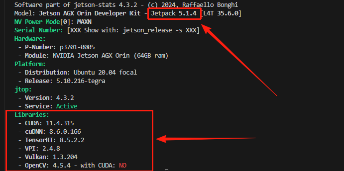
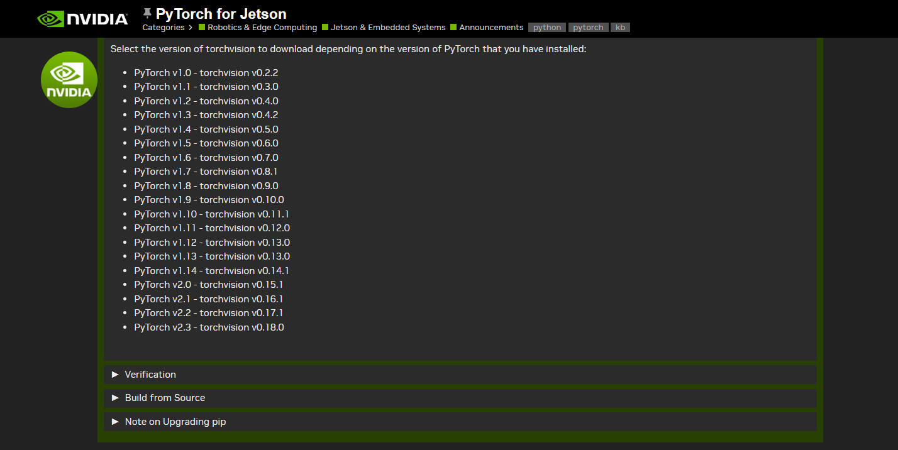
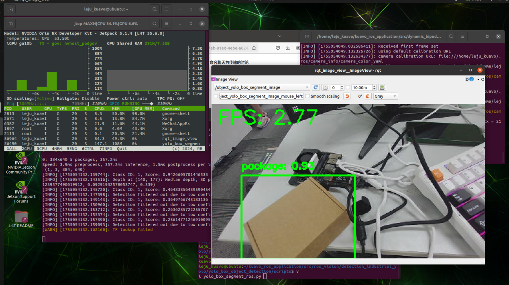
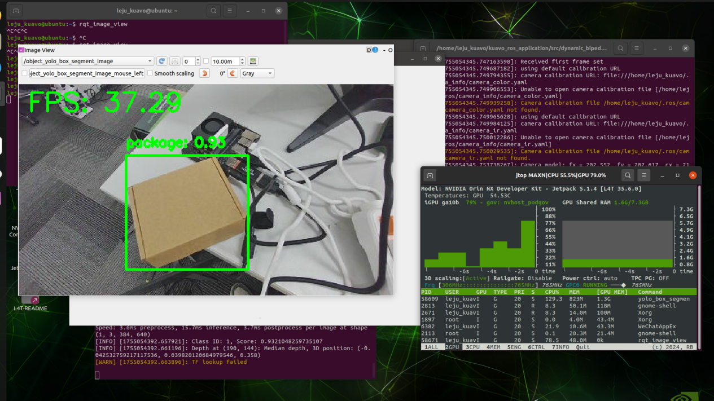

# yolov8目标检测案例

- [yolov8目标检测案例](#yolov8目标检测案例)
  - [功能包与代码结构](#功能包与代码结构)
  - [📦 箱子识别](#-箱子识别)
  - [🎯 针对于 YOLOv8 训练模型检测调用](#-针对于-yolov8-训练模型检测调用)
  - [📁 模型路径及说明](#-模型路径及说明)
  - [📡 箱子识别 ROS 话题订阅](#-箱子识别-ros-话题订阅)
  - [💻 yolo\_box\_object\_detection 功能包代码说明 (头部 NUC)](#-yolo_box_object_detection-功能包代码说明-头部-nuc)
  - [🔧 识别姿态四元数说明](#-识别姿态四元数说明)
  - [使用GPU加速说明](#使用gpu加速说明)
    - [安装 PyTorch、Torchvision 和 Ultralytics](#安装-pytorchtorchvision-和-ultralytics)
      - [1. 确认是否已安装 torch](#1-确认是否已安装-torch)
      - [2. 安装 PyTorch 2.0.0（JetPack 5.1.4 / CUDA 11.4）](#2-安装-pytorch-200jetpack-514--cuda-114)
      - [3. 安装 Torchvision（对应 0.15.1）](#3-安装-torchvision对应-0151)
      - [4. 安装 Ultralytics](#4-安装-ultralytics)
    - [修改代码及运行](#修改代码及运行)
      - [说明](#说明)
      - [代码段位置](#代码段位置)
      - [显式指定运行设备为 CPU](#显式指定运行设备为-cpu)
      - [显式指定运行设备为 GPU](#显式指定运行设备为-gpu)

## 功能包与代码结构
- 功能包：`yolo_box_object_detection` 用于箱子识别的 YOLO ROS 功能包
  - 功能包路径：`<kuavo_ros_application>/src/ros_vision/detection_industrial_yolo/yolo_box_object_detection`

- 示例代码
  - 路径：`<kuavo-ros-opensource>/src/demo/examples_code/yolo_detect/yolo_detect_info.py`
  - `yolo_detect_info.py`: 获取一次 `/object_yolo_box_tf2_torso_result` 检测结果基于机器人基座标系的位姿

## 📦 箱子识别

**使用前需要打开摄像头**
```bash
cd ~/kuavo_ros_application
source /opt/ros/noetic/setup.bash
source ~/kuavo_ros_application/devel/setup.bash 
# 旧版4代, 4Pro
roslaunch dynamic_biped load_robot_head.launch
# 标准版, 进阶版, 展厅版, 展厅算力版
roslaunch dynamic_biped load_robot_head.launch use_orbbec:=true
# MaxA版, MaxB版
roslaunch dynamic_biped load_robot_head.launch use_orbbec:=true enable_wrist_camera:=true
```

## 🎯 针对于 YOLOv8 训练模型检测调用

- 🔍 **yolo_box_object_detection** -- 箱子识别 YOLO ROS 功能包

## 📁 模型路径及说明

- 📂 路径：
  - `<kuavo_ros_application>/src/ros_vision/detection_industrial_yolo/yolo_box_object_detection`
- 📄 模型格式：`.pt`
- 🗂️ 模型路径：
  - `<kuavo_ros_application>/src/ros_vision/detection_industrial_yolo/yolo_box_object_detection/scripts/models/`

**打开检测程序**
```bash
cd ~/kuavo_ros_application
source /opt/ros/noetic/setup.bash
source ~/kuavo_ros_application/devel/setup.bash 
roslaunch yolo_box_object_detection yolo_segment_detect.launch 
```
- 如果上位机为agx或NX可能或出现下面报错：


在终端输入下面命令：
```bash
echo 'export LD_PRELOAD=/usr/lib/aarch64-linux-gnu/libgomp.so.1:$LD_PRELOAD' >> ~/.bashrc
```
开一个新的终端重新打开检测程序。

如果需要可视化检测效果，需要打开rqt_image_view或rviz(需要接显示屏或者远程桌面查看)，订阅object_yolo_box_segment_image话题查看效果


## 📡 箱子识别 ROS 话题订阅

```bash
/object_yolo_box_segment_result   # 基于相机坐标系下的箱子中心点的3D位置
/object_yolo_box_segment_image    # 识别箱子的绘制结果
/object_yolo_box_tf2_torso_result # 基于机器人基坐标系下的箱子中心点的3D位置
```

## 💻 yolo_box_object_detection 功能包代码说明 (头部 NUC)

- `yolo_box_segment_ros.py`: 
  - 调用模型检测并获取识别框中心点三维坐标位置
  - 发布到 `/object_yolo_box_segment_result`
  - 过滤低于 0.6 置信度的结果
- `yolo_box_transform_torso.py`: 
  - 订阅 `/object_yolo_box_segment_result` 
  - 将坐标转换到机器人基坐标系
  - 发布转换结果到 `/object_yolo_box_tf2_torso_result`


## 🔧 识别姿态四元数说明

- 📄 查看 `yolo_box_transform_torso.py` 文件第 71-74 行，由于检测只获取检测目标中心点空间位置无姿态信息，四元数为固定值非实际值

## 使用GPU加速说明
⚠️⚠️⚠️ **该部分仅适用于进阶版和Max版用户**
⚠️⚠️⚠️ **该部分仅适用于jetpack是5.1.4版本且CUDA是11.4版本**
- 查询方式
  - 终端执行`sudo -H pip install -U jetson-stats`安装工具
  - 终端执行`jetson_release`查看本地环境
  - 若下图红框中部分与终端结果一致,即可参考此文档使用GPU进行加速


### 安装 PyTorch、Torchvision 和 Ultralytics

- 新镜像自带以上依赖项，对于携带旧版镜像且需要使用GPU加速检测的设备，才需要补充安装 PyTorch、Torchvision 和 Ultralytics 

> ⚠️ 安装顺序非常重要：`torch -> torchvision -> ultralytics`  
> 原因：
> - torch 是核心底层  
> - torchvision 依赖 torch  
> - ultralytics 依赖 torch，可调用 torchvision transforms 
> - Jetson 内已编译好的 CUDA+cuDNN+JetPack，torch 必须匹配 CUDA 和 JetPack，否则自动安装可能出错

#### 1. 确认是否已安装 torch 
- 新开终端
    ```bash
    pip3 show torch
    ```
    - not found -> 安装 torch
    - 显示版本 -> 根据后续文档判断是否是可使用的torch，若不是则需要根据后续文档卸载安装
- 确定 Jetson NX/AGX 上位机 版本：
    ```bash
    dpkg-query --show nvidia-l4t-core
    ```
    > 参考[英伟达开发者官网](https://developer.nvidia.com/embedded/jetpack-archive)，本例显示 35.6.0，对应 JetPack 5.1.4 版本
- 确认 python3 版本：
    ```bash
    python3 --version
    ```
    > 本例中Python版本为3.8.10
- 删除旧 torch 防止冲突：
    ```bash
    sudo pip3 uninstall torch torchvision torchaudio -y
    ```
- 参考[英伟达官方论坛](https://forums.developer.nvidia.com/t/nvidia-jetson-nano/266696)找到合适版本的 torch（JetPack 5.1.4 对应 PyTorch 2.0.0）

#### 2. 安装 PyTorch 2.0.0（JetPack 5.1.4 / CUDA 11.4）

- 下载 whl 文件（可通过 SSH 传输到 Jetson NX/AGX 上位机）：
    ```bash
    wget https://nvidia.box.com/shared/static/i8pukc49h3lhak4kkn67tg9j4goqm0m7.whl \
         -O torch-2.0.0+nv23.05-cp38-cp38-linux_aarch64.whl
    ```
- 安装依赖：
    ```bash
    sudo apt-get install python3-pip libopenblas-base libopenmpi-dev libomp-dev
    pip3 install 'Cython<3'
    pip3 install numpy torch-2.0.0+nv23.05-cp38-cp38-linux_aarch64.whl
    ```
- 验证安装：
    ```bash
    python3 -c "import torch; print(torch.__version__)"
    ```
    > 输出示例：`2.0.0+nv23.05`，安装成功

#### 3. 安装 Torchvision（对应 0.15.1）
- 参考[文档链接](https://pytorch.org/get-started/previous-versions/)，安装对应版本的torchvision，此处如图对应0.15.1


- 安装依赖：
    ```bash
    sudo apt-get install libjpeg-dev zlib1g-dev libpython3-dev libopenblas-dev \
                         libavcodec-dev libavformat-dev libswscale-dev
    ```
- 克隆源码并安装：
    ```bash
    git clone --branch v0.15.1 https://github.com/pytorch/vision torchvision
    cd torchvision
    git fetch --tags
    git tag | grep v0.15.1
    git checkout tags/v0.15.1
    export BUILD_VERSION=0.15.1
    pip install 'pillow<7'
    python3 setup.py install --user
    ```
- 验证安装：
    ```bash
    pip install "urllib3<2"
    python3 -c "import torchvision; print(torchvision.__version__)"
    ```
    > 输出示例：`0.15.1`，安装成功

#### 4. 安装 Ultralytics

- 安装：
    ```bash
    pip3 install ultralytics
    python3 -c "import ultralytics; print(ultralytics.__version__)"
    ```
    > 输出版本信息即为安装成功

### 修改代码及运行

#### 说明
- 对于 YOLOv8，其程序中调用了 `ultralytics`，`ultralytics` 会自动依赖当前环境下的 `torch`。
- 镜像自带的是 GPU 版本的 `torch`，因此程序会自动使用 GPU 加速。
- 在 GPU 环境下，如果想测试 CPU 运行效果，需要手动指定设备为 CPU，下面提供显式指定CPU/GPU检测的办法。

#### 代码段位置
- 编辑文件`~/kuavo_ros_application/src/ros_vision/detection_industrial_yolo/yolo_box_object_detection/scripts/yolo_box_segment_ros.py`
在 `def main()` 内找到如下代码段：
```python
    # 使用 Ultralytics 加载模型
    model_path = os.path.join(rospkg.RosPack().get_path('yolo_box_object_detection'), 'scripts/models/best.pt')
    model = YOLO(model_path)
``` 

#### 显式指定运行设备为 CPU
- **修改代码**：
    ```python
    # 使用 Ultralytics 加载模型
    model_path = os.path.join(
        rospkg.RosPack().get_path('yolo_box_object_detection'),
        'scripts/models/best.pt'
    )
    model = YOLO(model_path).to('cpu')
    ```

- **运行效果如图所示**：

    - GPU 占用率几乎不升高
    - 帧率为个位数
    - ✅ 可验证 CPU 模式正常工作

#### 显式指定运行设备为 GPU
- **修改代码**：
    ```python
    # 使用 Ultralytics 加载模型
    model_path = os.path.join(
        rospkg.RosPack().get_path('yolo_box_object_detection'),
        'scripts/models/best.pt'
    )
    model = YOLO(model_path).to('cuda')
    ```

- **运行效果**：

    - GPU 占用率明显上升
    - 帧率可达到 30+ FPS
    - ✅ 可验证 GPU 模式正常加速


